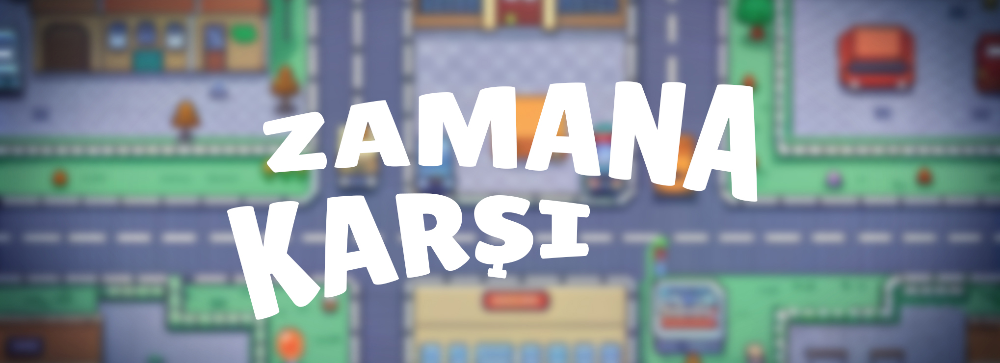

# ZAMANA KARŞI

   Küçük ve huzurlu bir kasaba, her gün batımında gizemli bir karanlığa bürünüyor. Kahramanımız Arda, bu kasabanın cesur ve maceraperest gençlerinden biri. Her gün, kasabanın büyük saat kulesinin çanları çalmadan önce belirli nesneleri toplaması ve eve dönmesi gerekiyor. Çünkü güneş battığında kasabanın sokakları, parkları ve binaları tehlikelerle dolu karanlık bir dünyaya dönüşüyor.

   Arda, her seviyede farklı görevlerle karşılaşıyor. Bazen kaybolmuş bir oyuncağı bulması gerekiyor, bazen de arkadaşlarına yardım etmek için belirli malzemeleri toplaması gerekiyor. Ancak her seferinde zamanı sınırlı ve güneş battığında kasabanın güvenli sokakları karanlık ve korkutucu bir yer haline geliyor. Karanlık çöktüğünde, Arda'nın hareket kabiliyeti kısıtlanıyor ve kasabanın gizemli yaratıkları ortaya çıkıyor.

## Oyun Mekaniği
- **Amaç:** Her seviyede belirtilen süre içinde gerekli eşyaları toplamak ve güvenli noktaya ulaşmak. Bu güvenli nokta, genellikle Arda'nın evi ya da belirli bir sığınak olabilir.
- **Zaman:** Her seviye için belirli bir süre olacak. Bu süre dolduğunda gece olacak ve oyuncu kaybedecek. Zaman, oyunun temel gerilim unsuru olarak hizmet ediyor.
- **Collectibles:** Oyuncu farklı seviyelerde farklı nesneler toplayacak. Bu nesneler, oyunun hikayesine uygun olarak değişiklik gösterecek. Örneğin, bir seviyede eski bir kitabı bulmak, başka bir seviyede ise arkadaşının kaybolan kedisini bulmak gibi.
- **Gece Mekaniği:** Süre dolduğunda gece olacak ve oyun sona erecek. Gece olduğunda ekstra zorluklar eklenebilir. Örneğin, görünmez düşmanlar, daha zor görünen yollar veya aniden ortaya çıkan engeller gibi.

## Oyun Özellikleri
1. **Bölüm Tabanlı İlerleme:** Oyuncular, her biri benzersiz bir meydan okuma ve hikaye ögesi sunan çeşitli bölümlerde ilerleyecekler.
2. **Gerilim ve Macera:** Zaman dolmadan önce görevleri tamamlamaya çalışırken, oyuncular sürekli bir gerilim içinde olacaklar.
3. **Gelişen Hikaye:** Her bölümde Arda'nın maceraları ve kasabanın sırları hakkında daha fazla bilgi edinecekler.
4. **Etkileşimli Çevre:** Kasaba, oyuncuların keşfetmesi ve etkileşime geçmesi için detaylı olarak tasarlanmıştır. Gizli nesneler, kısa yollar ve sürprizlerle doludur.
5. **Gelişen Zorluk:** İlerledikçe, bölümler daha karmaşık ve zorlayıcı hale gelecek, oyuncuların stratejik düşünmelerini ve hızlı hareket etmelerini gerektirecek.

## Kurulum ve Oynanış
1. **Oyunu İndir:** Oyunu indirin ve bilgisayarınıza kurun.
2. **Oynanış Talimatları:**
   - Karakteri WASD tuşları ile hareket ettirin.
   - Collectible nesneleri toplayın.
   - Zaman dolmadan güvenli noktaya ulaşın.
   - Gece olmadan görevlerinizi tamamlamaya çalışın.
